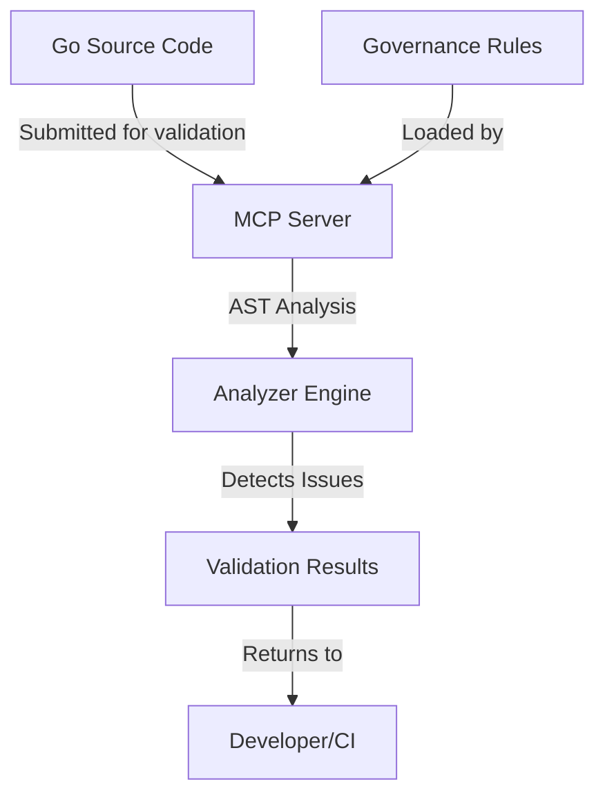

# Go-MCP-LSP: Golang Meta-Configuration Protocol Language Server

A Golang implementation of the Meta-Configuration Protocol (MCP) for language server integration and code governance enforcement through AST-based deep analysis.

## Overview

This project implements a governance system for Go code that leverages deep Abstract Syntax Tree (AST) analysis to enforce organizational coding standards. It provides both a JSON-RPC server exposing governance rules and client libraries for validation.



## Key Features

- **Deep AST-based Code Analysis**: Beyond simple pattern matching, understands code structure
- **Multiple Rule Categories**: Enforces standards for error handling, API design, concurrency, security, and organization standards
- **Precise Issue Reporting**: Provides exact file location (line, column) for detected issues
- **Flexible Validation**: Supports both CLI-based and server-based validation workflows
- **Modular Architecture**: Easily extend with new rule categories

## Components

- **MCP Server**: JSON-RPC server that exposes governance rules
- **Client Library**: Go client for communicating with the MCP server
- **AST Analyzer**: Deep code inspection based on Go's AST package
- **CLI Tools**: Command-line interface for validation and testing
- **Test Suite**: Comprehensive test cases for each rule category

## Rule Categories

1. **Error Handling**: Enforces proper error checking and handling
2. **API Design**: Validates API contracts, context usage, and parameter patterns
3. **Concurrency**: Detects race conditions and ensures proper synchronization
4. **Security**: Identifies weak cryptography, SQL injection risks, and credentials handling
5. **Organizational Standards**: Enforces coding style and architectural patterns

## Usage

### CLI Validation

```bash
# Standard pattern-based validation
go run cmd/mcplsp/main.go validate path/to/file.go error_handling,api_design

# Deep AST-based analysis
go run cmd/mcplsp/main.go -deep validate path/to/file.go error_handling,api_design
```

### Direct AST Analysis

```bash
go run cmd/ast-analyzer/main.go analyze --file path/to/file.go --rules error_handling
```

### Testing

```bash
# Test all rule categories
./scripts/test-governance.sh

# Compare standard vs. deep validation
./scripts/compare-validation.sh
```

## Project Structure

```
go-mcp-lsp/
├── cmd/
│   ├── mcplsp/       # CLI tool for MCP validation
│   └── ast-analyzer/ # CLI for AST-based code analysis
├── pkg/
│   ├── analyzer/     # Deep AST analysis engine
│   │   └── ast/      # AST-based code inspection
│   └── mcpclient/    # MCP client for JSON-RPC communication
├── server/
│   └── mcpserver/    # MCP server exposing governance rules
│       └── rules/    # Rule definitions by category
├── testdata/        # Test files for all rule categories
└── scripts/         # Test and validation scripts
```

## Development

### Prerequisites

- Go 1.19 or higher
- Understanding of Go's AST package for rule development

### Setup

```bash
# Clone the repository
git clone https://github.com/yourorg/go-mcp-lsp
cd go-mcp-lsp

# Build the CLI tools
go build -o bin/mcplsp cmd/mcplsp/main.go
go build -o bin/ast-analyzer cmd/ast-analyzer/main.go

# Run tests
go test ./...
```

### Adding New Rules

1. Define the rule in the appropriate category under `server/mcpserver/rules/`
2. Implement AST-based detection in `pkg/analyzer/ast/analyzer.go`
3. Add test cases in `testdata/` 
4. Update the CLI to expose the new rule category

## License

This project is licensed under the MIT License - see the LICENSE file for details.

## Contributing

Contributions are welcome! Please feel free to submit a Pull Request.

1. Fork the repository
2. Create your feature branch (`git checkout -b feature/amazing-feature`)
3. Commit your changes (`git commit -m 'Add some amazing feature'`)
4. Push to the branch (`git push origin feature/amazing-feature`)
5. Open a Pull Request
