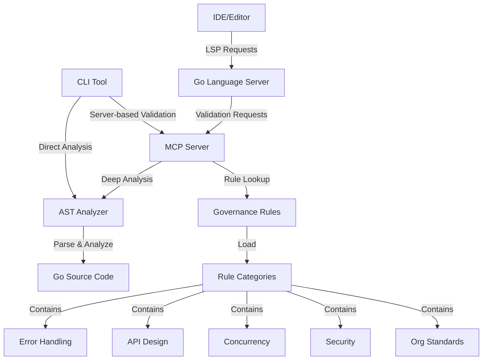
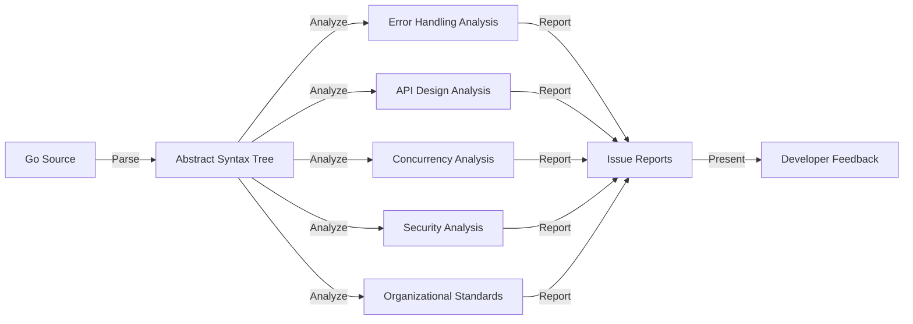
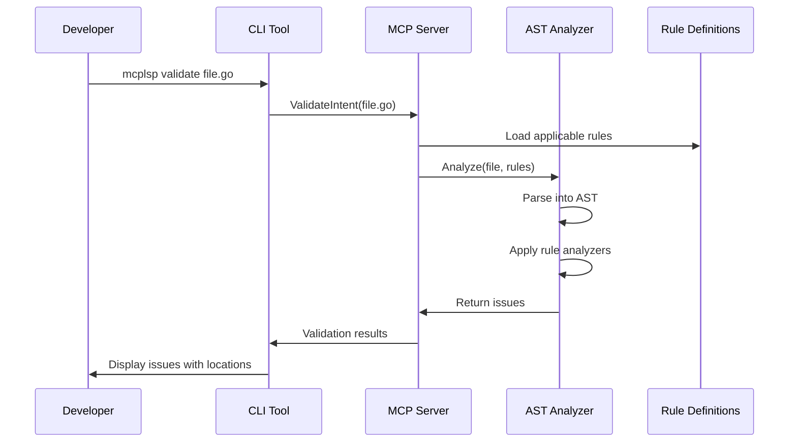

# PROJECT:

An intent-aware Golang Language Server integrates with MCP to enforce governance, generate code, and validate developer actions.

# SUMMARY:

This project creates an enhanced Go language server by integrating Meta-Configuration Protocol (MCP) capabilities for governance rule enforcement. The server implements deep AST-based code analysis to enforce organization-defined intents through structural linting, pattern detection, and comprehensive code inspection. Developers interact through CLI tools that provide real-time validation against governance rules. The system detects issues related to error handling, API design, concurrency safety, security, and organizational coding standards.

# STEPS:

1. Fork and modify `gopls` to support MCP integration.
2. Build a JSON-RPC 2.0 client to communicate with the MCP server.
3. Define intent-mechanism YAML structures for governance enforcement.
4. Implement AST/graph-based mechanisms to fulfill declared intents.
5. Add structural linting and boundary enforcement rules.
6. Embed scaffolding via `getPrompt` and `callTool` MCP endpoints.
7. Inject hover-based documentation using `getResource`.
8. Create save-time formatting, comment injection, and validation hooks.
9. Develop CLI tool `mcplsp` to test, audit, simulate, and verify.
10. Provide a reference MCP server exposing sample rules and templates.
11. Use snapshot and E2E tests to verify correct enforcement.
12. Integrate drift analysis and reporting for CI pipelines.
13. Organize code into composable modules using `pkg/` and `internal/`.
14. Script project setup, dependency fetching, and build tasks.
15. Deliver with README and developer onboarding documentation.
16. Ensure secure, versioned rules and deterministic test results.

# STRUCTURE:

```
go-mcp-lsp/
├── cmd/
│   ├── mcplsp/       # CLI tool for MCP validation
│   └── ast-analyzer/ # CLI for AST-based code analysis
├── pkg/
│   ├── analyzer/     # Deep AST analysis engine
│   │   └── ast/      # AST-based code inspection
│   └── mcpclient/    # MCP client for JSON-RPC communication
├── server/
│   └── mcpserver/    # MCP server exposing governance rules
│       └── rules/    # Rule definitions by category
├── testdata/
│   ├── error_handling/   # Test files for error handling rules
│   ├── api_design/       # Test files for API design rules
│   ├── concurrency/      # Test files for concurrency rules
│   ├── security/         # Test files for security rules
│   ├── organization/     # Test files for org standards
│   └── ast_analysis/     # Test files for AST analyzer
├── scripts/              # Test and validation scripts
└── README.md
```

# ARCHITECTURE:



# DETAILED EXPLANATION:

1. `cmd/mcplsp/` – CLI tool for validating Go files against governance rules
2. `cmd/ast-analyzer/` – Dedicated CLI for AST-based code inspection
3. `pkg/analyzer/` – Implements deep code analysis using Go's AST package
4. `pkg/analyzer/ast/` – Core AST parsing and inspection logic
5. `pkg/mcpclient/` – JSON-RPC client for communicating with the MCP server
6. `server/mcpserver/` – Lightweight JSON-RPC server exposing governance rules
7. `server/mcpserver/rules/` – Rule definitions organized by category
8. `testdata/` – Comprehensive test files covering various rule categories
9. `scripts/` – Testing and validation scripts

# AST-BASED ANALYSIS:



The AST-based analysis engine provides deep code inspection capabilities:

1. **Error Handling Analysis**: Detects missing error checks, ignored errors, and improper error handling patterns.
2. **API Design Analysis**: Validates context usage, parameter patterns, and interface design.
3. **Concurrency Analysis**: Identifies potential race conditions, improper mutex usage, and unsafe map access.
4. **Security Analysis**: Detects weak cryptography, SQL injection risks, and hardcoded credentials.
5. **Organizational Standards**: Enforces coding style, dependency injection patterns, and architectural constraints.

# CODE:

### File: `pkg/analyzer/ast/analyzer.go`

```go
// Core AST analyzer that performs deep code inspection
package ast

import (
	"go/ast"
	"go/parser"
	"go/token"
)

// Issue represents a governance rule violation
type Issue struct {
	RuleID      string
	Description string
	Severity    string
	Position    token.Position
}

// Analyzer performs AST-based code analysis
type Analyzer struct {
	fset        *token.FileSet
	config      AnalyzerConfig
}

// AnalyzeErrorHandling inspects error handling patterns
func (a *Analyzer) AnalyzeErrorHandling(file *ast.File) []Issue {
	// Deep AST-based analysis of error handling patterns
}

// AnalyzeAPIDesign inspects API design patterns
func (a *Analyzer) AnalyzeAPIDesign(file *ast.File) []Issue {
	// Deep AST-based analysis of API design
}

// Other analysis methods for concurrency, security, etc.
```

### File: `pkg/analyzer/analyzerengine.go`

```go
// Adapter that integrates the AST analyzer with the MCP server
package analyzer

import (
	"github.com/yourorg/go-mcp-lsp/pkg/analyzer/ast"
)

// AnalyzerEngine provides a high-level interface for code analysis
type AnalyzerEngine struct {
	analyzer *ast.Analyzer
}

// Analyze performs comprehensive analysis on a file
func (e *AnalyzerEngine) Analyze(filepath string, content []byte, ruleIDs []string) (*AnalysisResult, error) {
	// Coordinate analysis based on requested rules
}
```

### File: `server/mcpserver/server.go`

```go
// MCP server implementing the required JSON-RPC methods
package mcpserver

import (
	"github.com/yourorg/go-mcp-lsp/pkg/analyzer"
)

// ValidateIntent validates code against specified rules
func (s *MCPServer) ValidateIntent(req ValidateRequest, result *Result) error {
	// Use AST-based analyzer for deeper code inspection
	engine := analyzer.NewAnalyzerEngine()
	analysisResult, err := engine.Analyze("file.go", []byte(req.Content), req.RuleIDs)
	
	// Process analysis results and report issues
}
```

# VALIDATION WORKFLOW:



# TAKEAWAYS:

1. Enforces development intent through centrally defined governance.
2. Performs deep AST-based analysis for accurate issue detection.
3. Provides precise file location information for identified issues.
4. Modular architecture allows for easy extension with new rule categories.
5. Comprehensive testing ensures reliable governance enforcement.

# SUGGESTIONS:

1. Integrate with IDE extensions for real-time feedback.
2. Add severity-based filtering for validation results.
3. Implement auto-fix suggestions for common issues.
4. Extend AST analysis to cover more advanced code patterns.
5. Add benchmarking to ensure analysis performance on large codebases.

# README:

````markdown
# Go MCP Language Server

## Overview

A fork of `gopls` enhanced with MCP client integration for intent enforcement, code generation, and live documentation.

## Features

- Intent-aware autocompletion
- Rule-driven static analysis
- Template-based scaffolding
- Embedded org-style docs
- CLI tools for CI auditing

## Quick Start

```bash
git clone https://github.com/yourorg/go-mcp-lsp
cd go-mcp-lsp
make install
./scripts/audit.sh
````

## Directory Layout

See STRUCTURE section in project definition.

## Contributing

1. Fork the repo.
2. Run `make test`.
3. Submit PR with new intents or mechanisms.

````

# SETUP:
```bash
#!/bin/bash
# setup.sh - Initialize the go-mcp-lsp project

set -e

echo "[init] Cloning gopls and applying MCP patch..."
git clone https://github.com/golang/tools.git
cd tools/gopls
git checkout latest
patch -p1 < ../../../patches/mcp.diff

cd ../../
mkdir -p go-mcp-lsp/{cmd/pkg/internal/server/testdata/scripts}
touch go-mcp-lsp/scripts/audit.sh
chmod +x go-mcp-lsp/scripts/audit.sh

go mod init github.com/yourorg/go-mcp-lsp
go mod tidy

echo "[init] Setup complete."
````

Would you like to generate the reference MCP server next?
